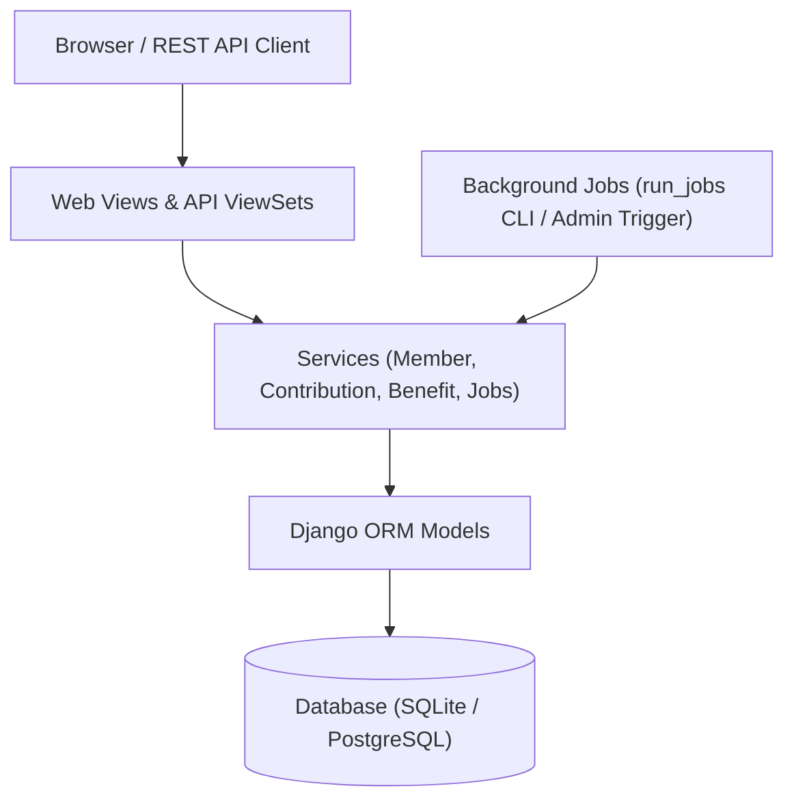
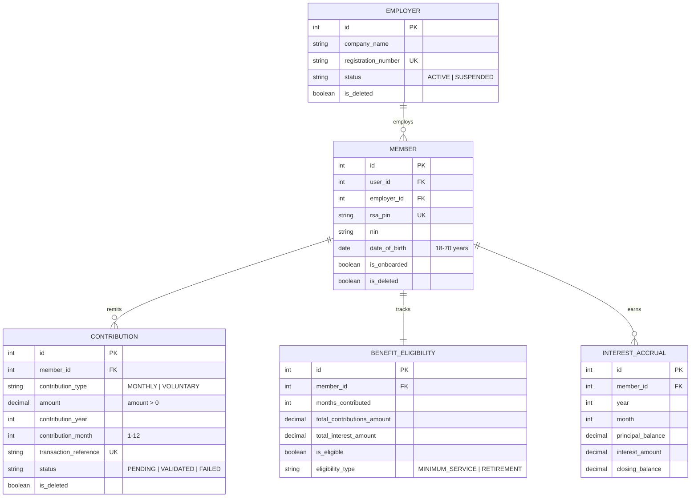
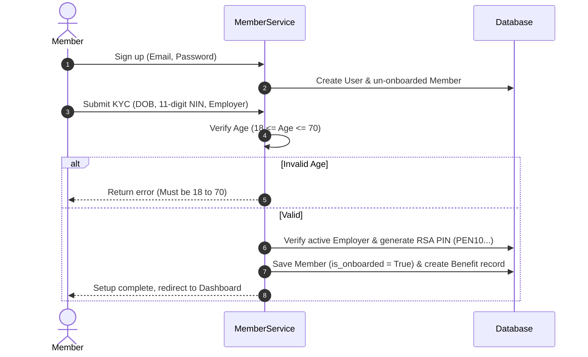
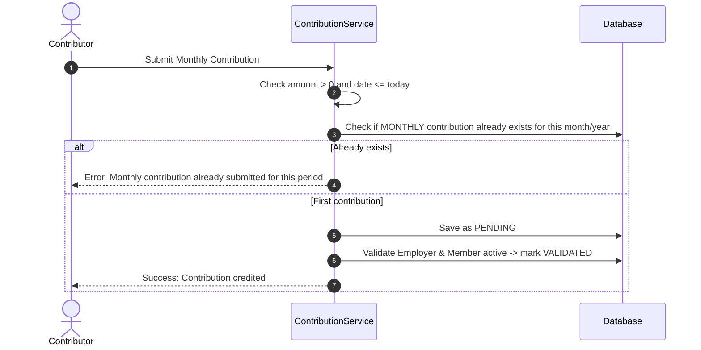
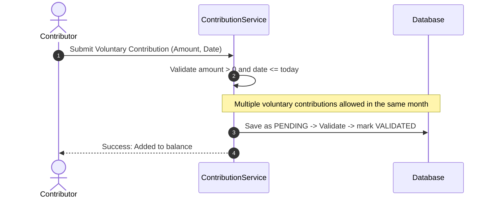
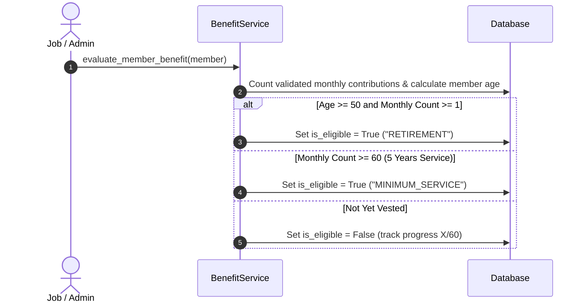
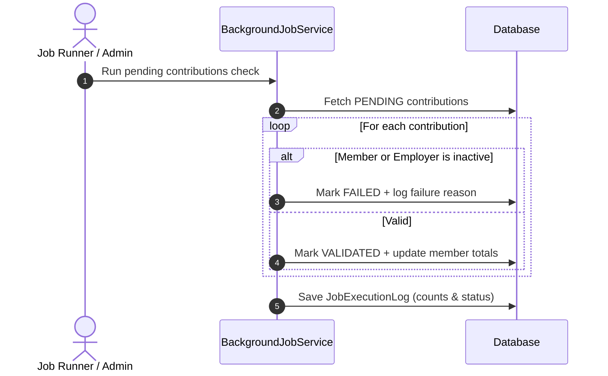

# EPS+ System Design Notes

**Project:** EPS+ Pension Contribution Management System  
**Developer:** Victor Ayomide  
**Role:** Junior Backend Developer (NLPC PFA Assessment)

---

## 1. Solution Architecture Flow

I structured the project using a simple 3-tier pattern to keep logic clean and easy to test:
- **Presentation:** Django Web Views (Bootstrap 5) and REST API (Django REST Framework).
- **Service Layer:** Business rules (age 18–70 checks, 1-per-month contribution rule, benefit vesting, interest accrual).
- **Data Layer:** Django ORM models with database-level constraints.

---

## 2. Entity Relationship Diagram (ERD)

> **Design note:** Models inherit from `BaseModel` for soft-deletion (`is_deleted = True`), ensuring financial audit history is never lost.

---

## 3. Process Flows (Sequence Diagrams)

### 3.1 Member Registration & KYC

### 3.2 Monthly Contribution Processing

### 3.3 Voluntary Contribution Processing

### 3.4 Basic Benefit Calculation

### 3.5 Background Job Execution & Retries

