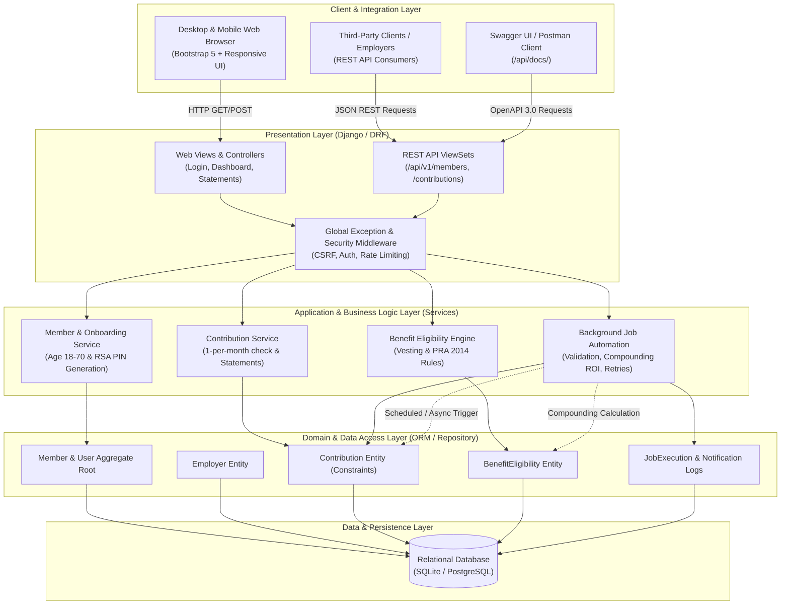
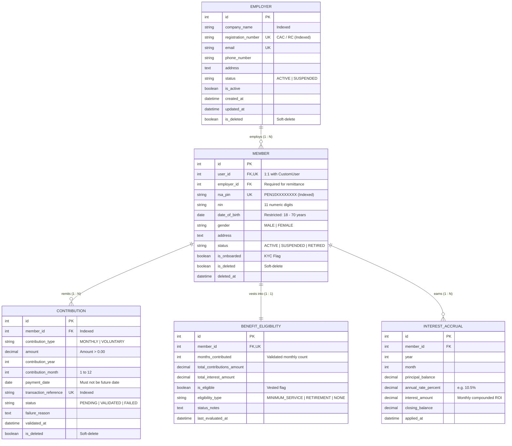
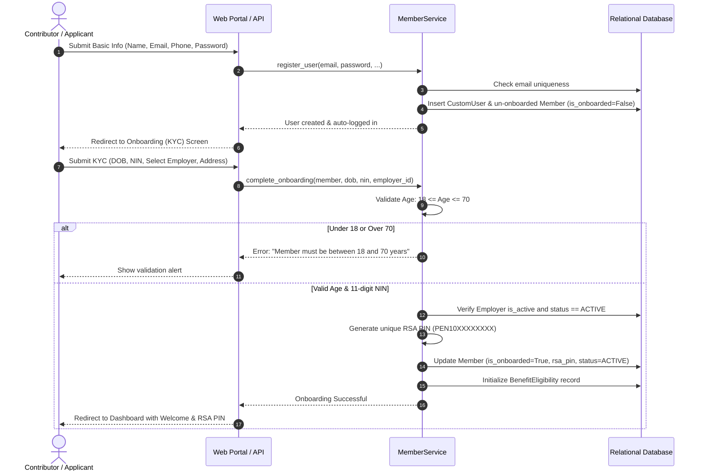
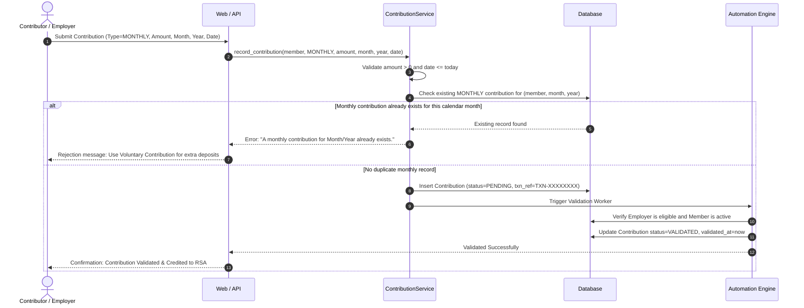
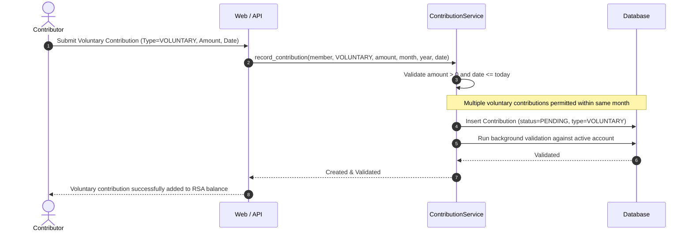
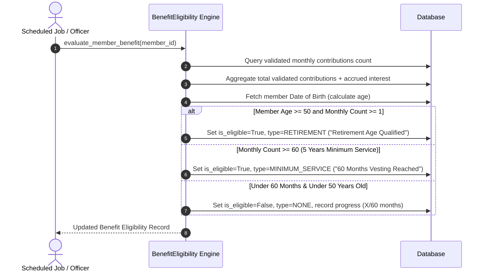
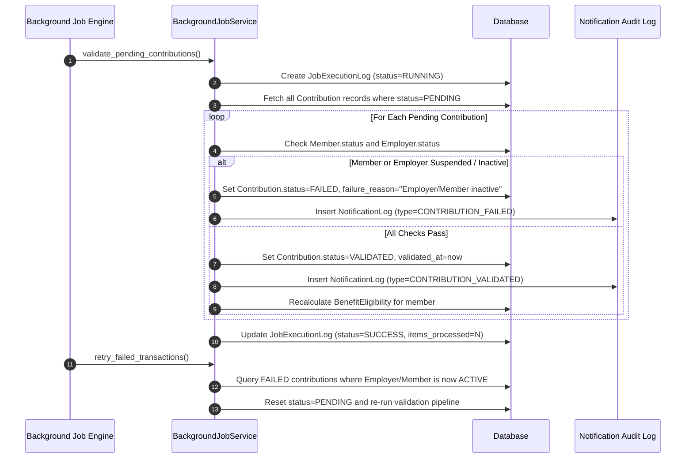

# EPS+ Pension Contribution Management System — System Design Document

**Organization:** NLPC PFA Limited  
**Project:** EPS+ (Customer Onboarding, BDRM & Contribution Management)  
**Deliverable:** System Architecture, Domain-Driven Design, Entity Modeling & Process Flows  

---

## 1. Solution Architecture Flow

The system employs a **Clean Layered Architecture** adhering to **Domain-Driven Design (DDD)** and **SOLID principles**. Presentation layers (Web UI and REST API) decouple from business orchestration (Services), domain models, and external storage engines.

---

## 2. Entity-Relationship Diagram (ERD)

The database schema models the lifecycle of contributors, their employers, mandatory and voluntary remittances, compounding returns, and benefit qualification.

---

## 3. Process Flows (Sequence Diagrams)

### 3.1 Member Registration & Onboarding Process
This flow implements the 2-step onboarding pattern: simple initial registration followed by regulatory KYC verification (Age 18–70, 11-digit NIN, active employer association, and RSA PIN generation).

---

### 3.2 Monthly Contribution Processing (1-Per-Month Enforced)

---

### 3.3 Voluntary Contribution Processing (AVC - Multiple Allowed)

---

### 3.4 Benefit Eligibility Calculation

---

### 3.5 Background Job Execution & Failure Handling

---

## 4. Interview Follow-Up Questions (Detailed Rationale)

### Question 1: Architecture Decisions
- **Chosen Architecture:** Clean Layered Architecture with Domain-Driven Design (DDD). We partitioned the application into core domain aggregates (`Member`, `Employer`, `Contribution`, `BenefitEligibility`), isolated business services (`MemberService`, `ContributionService`, `BackgroundJobService`), and presentation entry points (Bootstrap UI views and REST ViewSets).
- **Alternative Approaches Considered:**
  1. *Microservices:* Considered separating Members, Contributions, and Background Jobs into distinct microservices. However, for a single cohesive pension domain, a microservices setup introduces unnecessary distributed transaction overhead, network latency, and deployment complexity.
  2. *Standard Monolithic Fat-Models:* Considered embedding all business rules in Django model methods or views. This was rejected because business logic quickly leaks into HTTP controllers, making unit testing fragile and violating Single Responsibility.
- **Design Patterns Implemented:**
  - **Service Layer Pattern:** Encapsulates transaction management, validation orchestrations, and event triggers.
  - **Aggregate Root & Value Objects:** `Member` acts as an aggregate root coordinating profile state, RSA PIN generation, and benefit recalculation.
  - **Soft-Delete Pattern:** Implemented via `BaseModel` and custom `SoftDeleteManager` to ensure regulatory auditability (PRA 2014 forbids hard deletion of financial records).

### Question 2: Technical Choices
- **Database & ORM Design:**
  - Composite unique constraint `UniqueConstraint(fields=['member', 'contribution_year', 'contribution_month'], condition=Q(contribution_type='MONTHLY'))` guarantees that no race condition can ever produce duplicate monthly contributions at the database engine level.
  - Indexing on `rsa_pin`, `transaction_reference`, `(member_id, status)`, and `registration_number` for fast lookups.
- **Background Jobs Strategy:**
  - Modeled with idempotent job runners that can execute via Celery/Huey workers, cron schedules, or the PFA Operations Portal.
  - Every job writes to `JobExecutionLog` and `NotificationLog` with execution duration, count of processed items, and explicit failure reasons.
- **Error Handling Strategy:**
  - Defensive model and serializer validation raising structured `ValidationError` with distinct field keys.
  - Global transaction rollbacks via `@transaction.atomic` ensure that no partial writes occur if onboarding or contribution validation fails midway.

### Question 3: Scalability Considerations
- **Database Optimization:**
  - Read queries utilize `select_related('user', 'employer')` to prevent the N+1 query problem across high-volume listings.
  - Pre-aggregated balance calculations and indexed temporal ranges for Statement of Account generation.
- **Handling Large Datasets:**
  - Batch chunking (`QuerySet.iterator(chunk_size=1000)`) for monthly interest accrual across hundreds of thousands of members.
  - Distributed background workers handling contribution validation queues concurrently without locking member rows.
- **Caching Strategy:**
  - Cache member dashboard balance summaries with TTL invalidation triggered only when new contributions are validated or interest is credited.

### Question 4: Security Implementation
- **Authentication & Authorization:**
  - Django's battle-tested session and PBKDF2/SHA256 password hashing.
  - Role-Based Access Control (RBAC): Contributors access only their own dashboard and statements; PFA Administrators access the Operations Portal and background job controls.
- **Data Protection:**
  - PII masking on National Identity Numbers (NIN) in public responses.
  - Complete CSRF token verification across all POST, PUT, and DELETE forms and API requests.
- **API Security:**
  - Input sanitization through DRF serializers, SQL parameterization via ORM to completely eliminate SQL injection, and rate-limiting throttling classes to prevent brute-force attacks.
