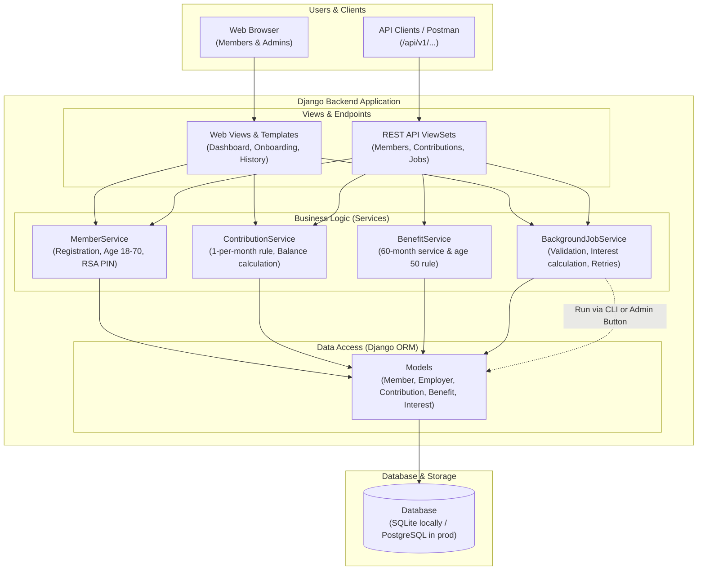
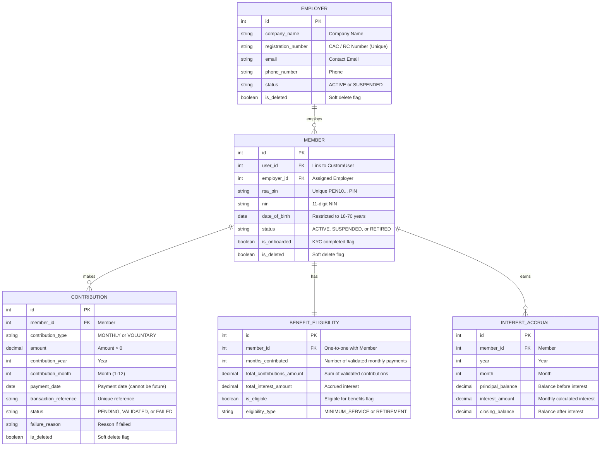
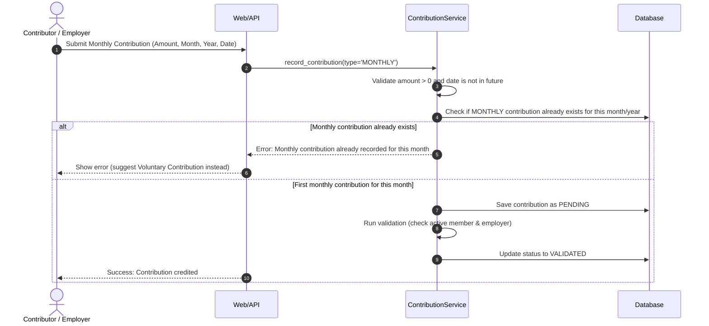
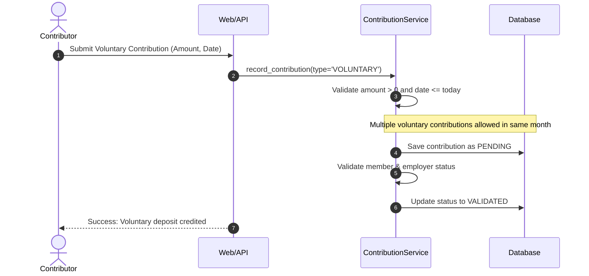
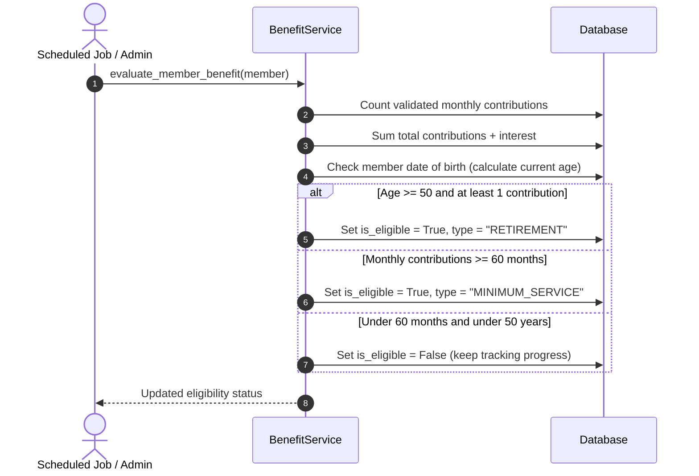
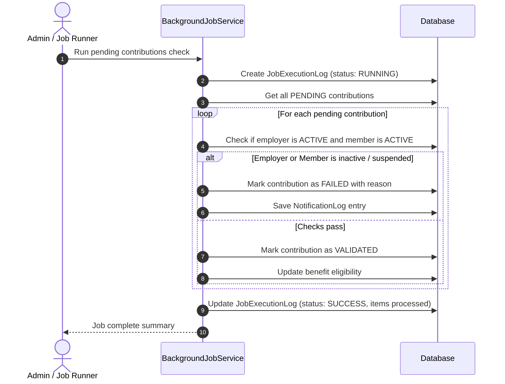

# EPS+ System Design & Implementation Notes

**Project:** EPS+ Pension Contribution Management System  
**Developer:** Victor Ayomide  
**Submitted for:** NLPC PFA Technical Assessment  

---

## 1. System Architecture

For this project, I chose a layered structure using Django and Django REST Framework. Rather than putting all the business logic inside the views or fat models, I separated the system into three main layers:

1. **Presentation / Web & API Layer:** Handles HTTP requests, form validations, and JSON responses (using Django standard views for the frontend and DRF ViewSets for the API).
2. **Service Layer (Business Logic):** Houses the core pension calculations, validation rules, benefit checks, and background tasks.
3. **Data Layer (ORM Models):** Manages the database schema, relationships, and constraints.

Here is a diagram showing how the different parts connect:

---

## 2. Database Design (Entity-Relationship Diagram)

The database schema has 5 main models representing the core pension workflow:

### Notes on Entity Design:
- **Soft Deletes:** Since financial records should never be permanently deleted, models inherit from a base model that includes `is_deleted` and `deleted_at`.
- **Database Constraint for Monthly Remittances:** I added a `UniqueConstraint` on `(member, contribution_year, contribution_month)` specifically for `MONTHLY` contributions. This ensures the database itself prevents double-remittance for the same month.

---

## 3. Process Flows (Sequence Diagrams)

### 3.1 Member Registration & KYC Onboarding
I broke onboarding into two steps: initial account signup, followed by KYC details (DOB, NIN, and selecting an active employer) before an RSA PIN is generated.

```mermaid
sequenceDiagram
    autonumber
    actor User as Member
    participant View as Web/API
    participant Service as MemberService
    participant DB as Database

    User->>View: Sign up (Name, Email, Password)
    View->>Service: Create user account
    Service->>DB: Save user (is_onboarded = False)
    View-->>User: Redirect to complete profile

    User->>View: Submit KYC (DOB, 11-digit NIN, Employer)
    View->>Service: complete_onboarding()
    Service->>Service: Check age (must be between 18 and 70)
    alt Age < 18 or > 70
        Service-->>View: Error: Age restriction failure
        View-->>User: Display age error
    else Valid Age
        Service->>DB: Verify employer exists and is ACTIVE
        Service->>Service: Generate unique RSA PIN (PEN10...)
        Service->>DB: Update member details & set is_onboarded = True
        Service->>DB: Create initial BenefitEligibility record
        View-->>User: Onboarding complete, show Dashboard
    end
```

---

### 3.2 Monthly Contribution Processing
Monthly contributions can only be recorded once per calendar month.

---

### 3.3 Voluntary Contribution Processing
Unlike monthly contributions, members can make voluntary contributions multiple times in a month.

---

### 3.4 Benefit Eligibility Calculation
Checks if the contributor has either reached 60 months of contributions (5 years) or is 50+ years old.

---

### 3.5 Background Job Execution & Failure Handling
Validates pending contributions, runs interest calculations, and logs results so failed transactions can be inspected and retried.

---

## 4. Interview Follow-Up Questions (My Thought Process)

### 1. Architecture Decisions
- **Why I chose this structure:**  
  I used a modular Django setup with dedicated apps (`members`, `employers`, `contributions`, `benefits`, `jobs`) and a service layer. This keeps views focused purely on handling requests, while the actual business logic (like age validation and monthly contribution restrictions) lives in the services where it can easily be tested with unit tests.
- **Alternatives considered:**  
  I thought about building a microservices architecture, but given the scope and tight relationships between members, employers, and contributions, a microservices setup would have added unnecessary complexity (like managing distributed transactions and separate databases) for what is currently a single cohesive system.
- **Patterns used:**  
  - Service pattern for business logic.
  - Soft-delete pattern (`BaseModel`) so records are marked inactive instead of being permanently removed from the database.

---

### 2. Technical Choices
- **Django & Django REST Framework:**  
  I chose Django and DRF because Django provides reliable built-in authentication, an ORM with migration handling, and an admin interface out of the box, while DRF makes generating REST APIs straightforward.
- **Database constraints:**  
  Instead of only relying on `if` conditions in Python code, I added a database `UniqueConstraint` on the `Contribution` table for monthly contributions. That way, even if two requests come in at the same moment, the database itself will prevent duplicate entries.
- **Background Jobs:**  
  In this submission, background jobs are implemented as service methods that can be triggered via Django management commands (`python manage.py run_jobs`) or from the admin portal. Every execution records a log in the database with timestamps and status notes.

---

### 3. Scalability Considerations
- **Database queries:**  
  To avoid the N+1 query problem, I used `select_related('user', 'employer')` when fetching member and contribution listings.
- **Caching:**  
  Calculating member totals (total contributions, monthly count, and interest) requires running aggregate database queries. I added caching to `get_member_totals()` so repeated dashboard views load quickly, and invalidated the cache whenever a new contribution is saved.
- **Future production improvements:**  
  As the system grows to handle hundreds of thousands of members:
  - Migrate from SQLite to PostgreSQL.
  - Offload background jobs to Celery with Redis so jobs run completely out-of-process.
  - Use database batch chunking (`iterator()`) when running interest calculations across large datasets.

---

### 4. Security Implementation
- **Authentication & Permissions:**  
  Django's standard authentication with PBKDF2 password hashing is used. Custom role checks ensure that regular contributors can only see their own dashboard and statements, while admin operations (like triggering batch jobs or viewing all members) are restricted to staff users.
- **Input Validation:**  
  All forms and API endpoints validate input types, check that contribution amounts are positive numbers, and reject future payment dates.
- **Data Protection:**  
  CSRF protection is enabled on all web forms, and standard ORM queries are used throughout to protect against SQL injection.
